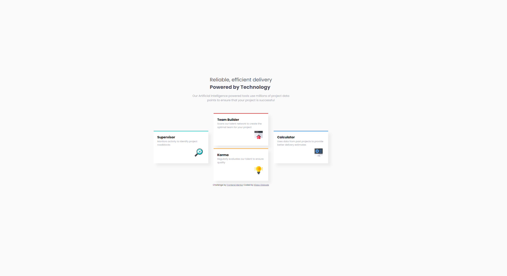

# Frontend Mentor - Four card feature section

This is a solution to the [Four card feature section challenge on Frontend Mentor](https://www.frontendmentor.io/challenges/four-card-feature-section-weK1eFYK). Frontend Mentor challenges help you improve your coding skills by building realistic projects. 

## Screenshot

## Overview

### The challenge

Users should be able to:

- View the optimal layout for the site depending on their device's screen size

### Links

- Solution URL: [Solution URL](https://github.com/Great-kiola/Four-card-feature-section-fem)
- Live Site URL: [Live site URL](https://great-kiola.github.io/Four-card-feature-section-fem/)

### Built with

- Semantic HTML5 markup
- CSS custom properties
- Flexbox
- CSS Grid
- Mobile-first workflow

## Author

- GitHub - [GH](https://github.com/Great-kiola)
- Frontend Mentor - [@great-kiola](https://www.frontendmentor.io/profile/great-kiola)

